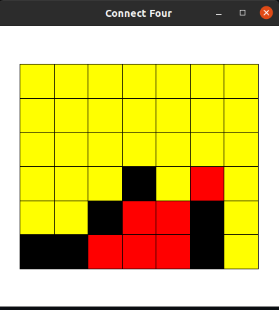
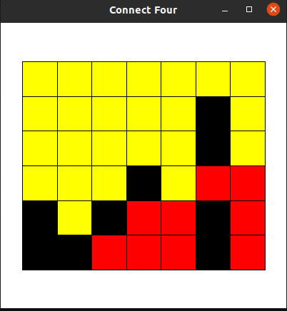
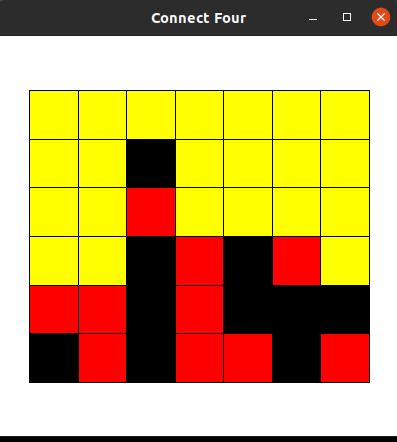

# Connect Four

Connect Four is a multiplayer game that allows computer and user to play against each other. The game is creating using python modules provided by the W&L CS department. This program was created to test my understanding of Object Oriented Programming, function, and proper documentation.

## How to Play 
1. Run connectFour.py using python3 
2. The game window will load
3. Clck on any column you want to capture. (hint: the best strategy is to start with the central colum ;) )
4. Wait for the computer to make its move. 
5. Keep playing until the game is over. The program will close itself when there are 4 blocks of the same color horizontally, vertically or diagonally.  

## Some snapshots of the game

